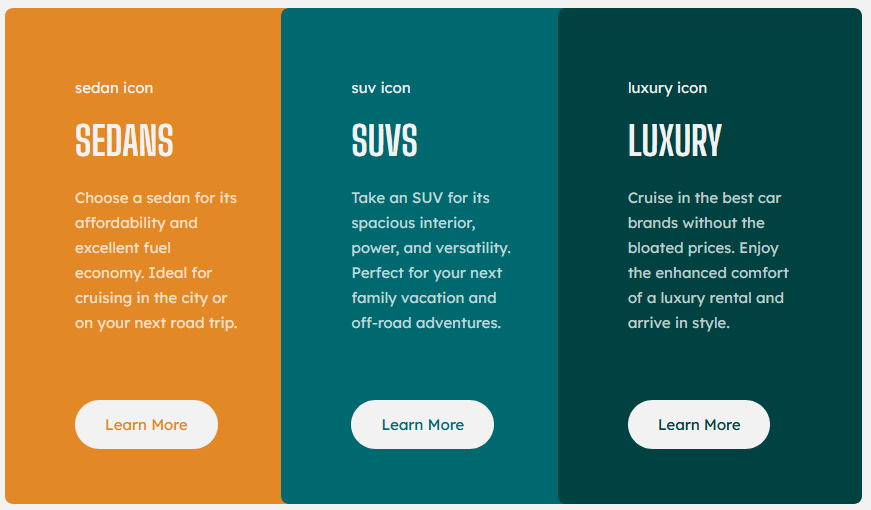

# Frontend Mentor - 3-column preview card component solution

This is a solution to the [3-column preview card component challenge on Frontend Mentor](https://www.frontendmentor.io/challenges/3column-preview-card-component-pH92eAR2-). Frontend Mentor challenges help you improve your coding skills by building realistic projects. 

## Table of contents

- [Overview](#overview)
  - [The challenge](#the-challenge)
  - [Screenshot](#screenshot)
  - [Links](#links)
- [My process](#my-process)
  - [Built with](#built-with)
  - [Continued development](#continued-development)
  - [Useful resources](#useful-resources)
- [Author](#author)
- [Acknowledgments](#acknowledgments)

## Overview

### The challenge

Users should be able to:

- View the optimal layout depending on their device's screen size
- See hover states for interactive elements

### Screenshot

### Links

- Solution URL:(https://github.com/cassandradauphin/3-column-preview-cards)
- Live Site URL:(https://3-column-preview-cards.netlify.app/)

## My process

### Built with

- Semantic HTML5 markup
- CSS custom properties
- SASS
- Mobile-first workflow
- Flexbox

### Continued development
- Learn more about SASS structure
- Learn more about CSS mobile 1st design 
- Learn more about CSS flexbox layout

### Useful resources

- [Resource 1](https://www.w3schools.com/) - This helped me for CSS media query. I really liked this pattern and will use it going forward.
- [Resource 2](https://css-tricks.com/snippets/css/a-guide-to-flexbox/) - This is an amazing article which helped me finally understand CSS flexbox. I'd recommend it to anyone still learning this concept.

## Author

- Frontend Mentor - [@cassandradauphin](https://www.frontendmentor.io/profile/cassandradauphin)
- Twitter - [@The_Haitian_Dev](https://www.twitter.com/The_Haitian_Dev)
- Website - [CassandraDauphin](https://www.cassandradauphin.com/)

